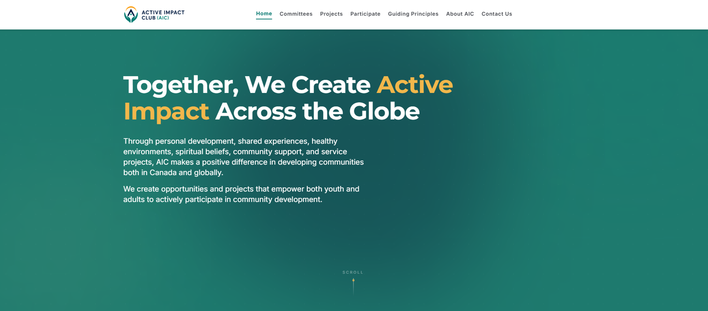
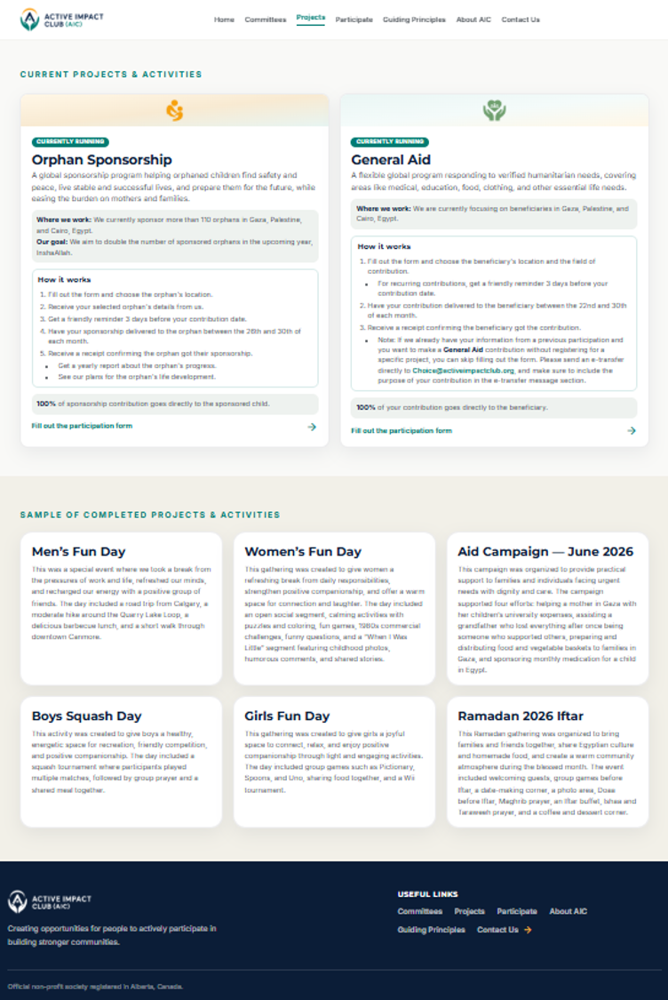
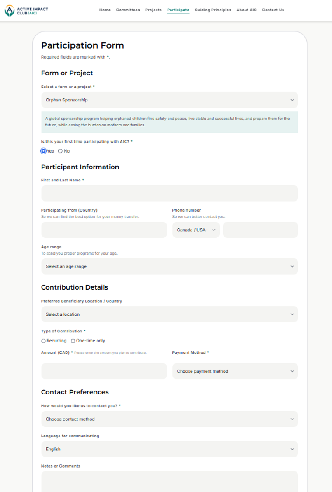
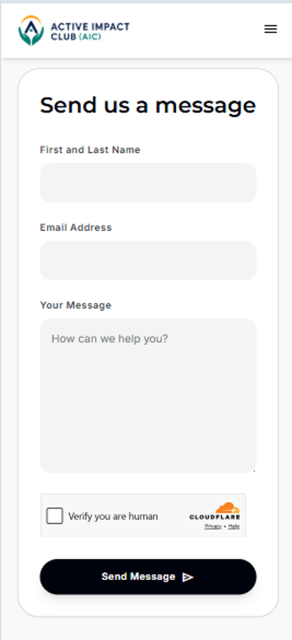

# Active Impact Club Website  
## AI-Assisted Product Leadership Case Study

A real-world case study documenting how I led the product definition, AI-assisted delivery, quality assurance, deployment, and public launch of the Active Impact Club website.

> **Portfolio note:** This repository documents my product leadership and contributions to the project. The official production source code is maintained separately by the Active Impact Club organization.
---

## Product Walkthrough

### Public Website Experience

The launched website provides a clear public entry point to AIC’s mission, programs, projects, guiding principles, and participation opportunities.

  

### Projects and Participation Journey

The Projects experience presents current initiatives and completed community activities, while the Participation Form provides a structured, project-connected workflow for contributors and participants.

<table>
  <tr>
    <td width="50%" valign="top">
      
    </td>
    <td width="50%" valign="top">
      
    </td>
  </tr>
  <tr>
    <td align="center"><strong>Projects and Activities</strong></td>
    <td align="center"><strong>Participation Form</strong></td>
  </tr>
</table>

### Responsive Mobile Experience

The website was reviewed and refined for mobile navigation, readable forms, responsive layouts, accessibility, and touch-friendly interactions.

  

---

## Overview

Active Impact Club is a nonprofit society registered in Alberta, Canada. It creates opportunities for youth and adults to participate in personal development, community service, humanitarian aid, and other initiatives in Canada and internationally.

The website was created to establish AIC’s public digital presence, clearly explain its mission and operating principles, present its committees and projects, and provide a structured way for people to participate.

I led the initiative from evolving organizational requirements and early concepts through production launch and continued improvement.

---

## My Role

I served as the end-to-end product leader and performed responsibilities across several functions:

- AI Product Manager
- Product Manager and Product Owner
- Technical Product Manager
- Business Analyst
- UX and Service Design Lead
- Content Strategist
- AI-Assisted Delivery Lead
- Quality Assurance and Release Lead
- Governance, Privacy, and Risk Lead

This required coordinating work that would traditionally involve product, design, content, engineering, QA, operations, and release-management contributors.

---

## Product Challenge

AIC needed more than a basic informational website. The digital experience had to:

- Translate a developing nonprofit operating model into a clear public product.
- Communicate AIC’s mission, committees, projects, and guiding principles.
- Build trust through transparency, dignity, privacy, and accurate expectations.
- Support people who wanted to participate in projects and activities.
- Work effectively across desktop and mobile devices.
- Establish a maintainable foundation for future organizational capabilities.

The source information was evolving and included a combination of Arabic and English content, informal requirements, operational decisions, and governance considerations.

---

## Key Achievements

- Defined the product vision, launch scope, audiences, information architecture, and principal user journeys.
- Translated organizational needs into structured product requirements and implementation tasks.
- Created the website structure across Home, Committees, Projects, Guiding Principles, About AIC, Participate, and Contact.
- Designed the participation journey, including project selection, contribution details, contact preferences, transfer methods, and acknowledgment requirements.
- Structured content for ongoing projects, completed activities, committee objectives, FAQs, and contribution instructions.
- Directed UX improvements across navigation, forms, responsive layouts, mobile ordering, accordions, content hierarchy, and calls to action.
- Led the development and implementation of website-ready brand assets, including logos and committee icons.
- Coordinated integration between the public participation form and its supporting API.
- Troubleshot form submissions, configuration, deployment, and environment-related issues.
- Managed source-control and delivery workflows through branches, pull requests, reviews, merges, and production deployments.
- Conducted launch-readiness reviews covering functionality, content, mobile responsiveness, visual quality, and workflow consistency.
- Moved the product from early concepts to a publicly accessible production website.

---

## AI-Assisted Product Delivery

I used AI-assisted development workflows to accelerate the project while retaining responsibility for product decisions and release quality.

My approach included:

1. Converting organizational needs into focused implementation prompts and acceptance expectations.
2. Breaking larger changes into smaller, reviewable tasks.
3. Using Codex to support implementation, debugging, and code changes.
4. Reviewing generated outputs for business accuracy, user experience, technical fit, and governance alignment.
5. Testing changes before approving pull requests and production deployment.
6. Refining requirements when generated outputs did not meet quality or usability expectations.

AI was used as a delivery multiplier—not as a substitute for product judgment, validation, governance, or human accountability.

---

## Core User Journeys

The launched website allows visitors to:

1. Understand AIC’s mission and purpose.
2. Explore its development, aid, sponsorship, IT, and management committees.
3. Review ongoing and previous projects and activities.
4. Understand the organization’s guiding principles.
5. Select a project and submit participation information.
6. Learn how contributions are managed.
7. Contact the organization and review common questions.

---

## Trust, Governance, and Transparency

The product experience communicates several important organizational principles:

- AIC is volunteer-led.
- Contributions are directed to projects and aid.
- AIC does not issue charitable tax receipts.
- Proof of delivery may be provided while protecting beneficiary privacy and dignity.
- The organization is non-political and non-factional.
- Assistance is not restricted by geographic, racial, political, or cultural boundaries.
- Public claims and contribution expectations must remain clear and accurate.

These principles influenced product requirements, content decisions, confirmation statements, and workflow design.

---

## Delivery and Operations

The project included responsibility for:

- GitHub source control
- Branch and pull-request workflows
- AI-assisted implementation using Codex
- Production deployment through Cloudflare Pages
- Domain and environment configuration
- API integration and submission troubleshooting
- Responsive and mobile validation
- Content and asset quality reviews
- Post-launch improvements

---

## Product Leadership Lessons

### Start with the operating model

The website could not be designed effectively without first clarifying how AIC works, what it offers, and what commitments it makes to participants and beneficiaries.

### AI output still requires ownership

Generated code, content, and visual assets required review, testing, correction, and occasionally complete replacement.

### Trust is part of the product

For a nonprofit, transparency, privacy, dignity, and accurate expectations are product requirements—not simply legal or editorial considerations.

### Launch is a product milestone, not the end

The first public release established a foundation for continued improvements, automation, project reporting, communication tools, and internal operational capabilities.

---

## Current Status

**Public website launched**

The initial production release includes AIC’s principal informational pages, committee and project content, guiding principles, participation workflow, contact experience, responsive design, and production deployment.

Continued work includes content expansion, operational automation, enhanced reporting, and future digital tools supporting AIC’s committees and participants.

---

## Links

- **Live website:** [activeimpactclub.org](https://activeimpactclub.org/)
- **Official organization:** [Active Impact Club on GitHub](https://github.com/Active-Impact-Club)
- **Product lead:** [Khaled Ahmed](https://github.com/khaledahmed-Tech)
- **Product architecture:** [View the architecture and delivery model](docs/ARCHITECTURE.md)
- **Product decisions:** [Review the key product decisions and trade-offs](docs/PRODUCT_DECISIONS.md)

---

## Repository Scope

This repository contains product-management documentation and may later include:

- Product case-study materials
- Product architecture diagrams
- Key product decisions
- AI-assisted delivery approach
- Launch and QA documentation
- Approved public screenshots

It does not contain AIC participant information, confidential operational data, credentials, API keys, or production secrets.
