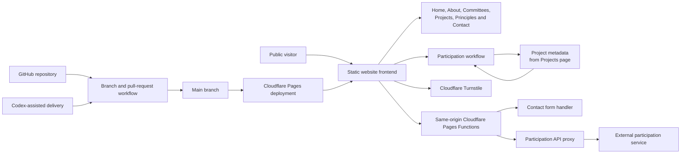
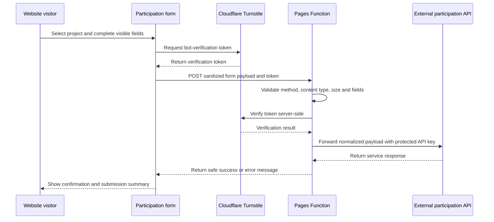
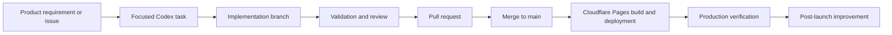

# Active Impact Club Website — Product Architecture

## Purpose

This document explains the high-level architecture and delivery model behind the Active Impact Club public website. It focuses on product and system responsibilities rather than exposing production secrets or implementation-specific credentials.

The architecture was intentionally kept lightweight for the initial public launch while still supporting secure form submissions, responsive public content, maintainable project configuration, and future expansion.

---

## Architecture at a Glance

---

## Core Components

### 1. Static Website Frontend

The public experience is implemented as a lightweight static website using HTML, CSS, and JavaScript.

It provides:

- Public informational pages
- Responsive desktop and mobile layouts
- Committee and project content
- Guiding principles and trust-related information
- Contact and participation workflows
- Accessible navigation and success dialogs

This approach reduced infrastructure complexity and supported fast deployment through Cloudflare Pages.

### 2. Projects as a Source of Product Metadata

The Projects page is not only presentation content. It also acts as a lightweight source of structured metadata for the Participation Form.

Current project cards expose approved metadata such as:

- Project title
- Project summary
- Supported beneficiary locations

The Participation page reads that metadata and uses it to populate its project and beneficiary-location options.

This avoids maintaining separate hard-coded project lists in multiple pages and reduces the chance of inconsistent user experiences.

### 3. Participation Workflow

The Participation Form supports a conditional journey based on the selected project and whether the person has participated previously.

The workflow includes:

- Project selection
- Project-specific beneficiary locations
- First-time and returning-participant paths
- Participant information
- Contribution details
- Contact preferences
- Visible-field validation
- Cloudflare Turnstile verification
- Submission confirmation with copy and download options

Hidden or inactive fields are disabled so they do not interfere with browser validation or submission payloads.

### 4. Cloudflare Pages

Cloudflare Pages hosts and deploys the public website.

Its responsibilities include:

- Serving static site assets
- Publishing updates from the production branch
- Hosting same-origin serverless Pages Functions
- Managing production environment variables
- Supporting the public domain
- Providing Cloudflare Turnstile integration

### 5. Server-Side Pages Functions

Browser forms submit to same-origin endpoints rather than calling protected external services directly.

The Pages Functions layer provides a security boundary by:

- Accepting only expected HTTP methods and content types
- Validating and normalizing request payloads
- Enforcing request-size limits
- Verifying Turnstile tokens server-side
- Reading protected configuration from environment variables
- Returning safe user-facing responses
- Preventing API keys and upstream service details from reaching the browser

The Participation Function acts as a secure proxy to the external participation service.

### 6. External Participation Service

The external participation service receives the validated and normalized participation payload from the Cloudflare Pages Function.

The browser does not receive or use the external service API key. Authentication is added only within the server-side function using protected environment configuration.

---

## Participation Data Flow

---

## Security and Privacy Boundaries

### Secrets

Production credentials and service configuration are stored as Cloudflare environment variables. They are not committed to GitHub or embedded in frontend JavaScript.

Examples of protected configuration include:

- External participation service URL
- External participation API key
- Turnstile secret key

### Browser Boundary

The browser receives only public assets, public project metadata, and safe form responses. It does not receive backend credentials or private upstream error details.

### Validation

Validation occurs at more than one layer:

- The frontend validates visible required fields and provides user feedback.
- The Pages Function validates and normalizes the submitted payload again.
- Turnstile verification is enforced on the server side.

Client-side validation improves usability, while server-side validation protects the service boundary.

### Data Minimization

The website collects only the fields required for the selected participation path. Conditional fields that are hidden are disabled and excluded from submission.

The portfolio repository contains no participant submissions, credentials, confidential operational records, or production secrets.

---

## Delivery Architecture

### GitHub

GitHub is used for:

- Source control
- Branching
- Pull requests
- Change review
- Commit history
- Release traceability

### AI-Assisted Delivery

Codex supported implementation, troubleshooting, and incremental changes. Each task was scoped and reviewed against product requirements, user experience, security, accessibility, and production readiness.

AI-generated changes were treated as proposed implementation—not automatically accepted output.

### Quality Controls

The release process included combinations of:

- Site validation scripts
- JavaScript syntax checks
- Link, asset, and form-label checks
- Git diff and whitespace checks
- Cloudflare preview review
- Desktop and mobile inspection
- Production form verification

---

## Key Architecture Decisions

### Use a static-first architecture

A static frontend was sufficient for the launch scope and reduced hosting, operational, and maintenance complexity.

### Keep protected integrations server-side

Cloudflare Pages Functions provide a small backend boundary without requiring a separate application server.

### Use same-origin form endpoints

The frontend submits to `/api/...` routes on the same site. This simplifies browser integration and prevents direct exposure of external API credentials.

### Maintain project options from project content

Reading approved project metadata from the Projects page creates a lightweight source-of-truth pattern and reduces duplicated configuration.

### Avoid premature platform complexity

The initial release does not require user accounts, a public database, a content-management system, or a custom administration portal.

---

## Current Scope and Non-Goals

The launched architecture supports a public nonprofit website and structured participation workflows.

It does not currently provide:

- Member authentication or access control
- A participant self-service account
- An internal administration dashboard
- A public donation-processing platform
- A website content-management system
- A public participant database
- Automated project reporting or beneficiary case management

These are potential future capabilities and should be introduced only when the operating model, governance, privacy requirements, and organizational capacity justify them.

---

## Future Evolution Options

Potential future architecture improvements include:

- A managed content workflow for committees and projects
- Structured project-status and impact reporting
- Role-based internal administration
- Notification and communication automation
- Contribution reconciliation workflows
- Consent and preference management
- Operational analytics and funnel measurement
- Centralized audit logs and monitoring
- Automated deployment checks and browser testing

Future changes should preserve the existing principles of simplicity, privacy, transparency, and controlled access to sensitive information.

---

## Architecture Ownership

I led the product-level architecture decisions, requirements, workflow design, delivery coordination, validation, and launch readiness for the website.

The architecture reflects a product-management approach: selecting the simplest viable technical design, creating clear security boundaries, connecting user journeys to operational needs, and establishing a foundation that can evolve without overengineering the initial release.
